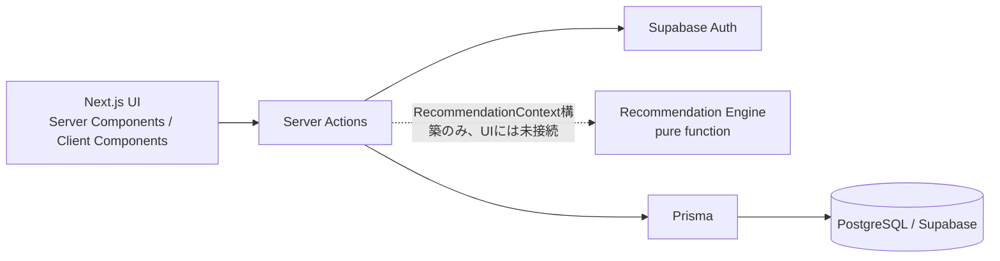

# LoopLift

> なんとなくの筋トレを、成長が見えるトレーニングへ。

LoopLiftは、筋トレ初心者〜初中級者を対象としたトレーニング支援Webアプリです。
「今日は何をすればいいか」「どの重量・回数で行えばいいか」「自分が成長しているか」を、
記録と分析にもとづいて分かりやすくすることを目指しています。

Next.js App Router / TypeScript / Prisma / PostgreSQL（Supabase）/ Supabase Auth で構築しています。

## Product Concept

LoopLiftは、以下のループを軸に設計しています。

```
Condition → Recommendation → Workout → Analytics → 次回のCondition/Recommendation
```

- **Condition**: 睡眠・疲労・可用時間・部位別の筋肉痛など、その日の状態を記録する
- **Recommendation**: Conditionと過去の記録から、今日やるべきトレーニングを判断する
- **Workout**: 実際にトレーニングを記録する（重量・回数・RIRなど）
- **Analytics**: 記録から推定1RMやVolumeの推移を可視化し、成長を確認する

この循環（**Loop**）を繰り返しながら、トレーニング（**Lift**）を積み重ねていく、という意味で
「LoopLift」と名付けています。

> **現在の開発状況**: 上記ループのうち、Condition・Workout・AnalyticsはUIとして完成していますが、
> RecommendationはドメインロジックとContext構築クエリまでが実装済みで、**HomeへのUI表示はまだ未接続**です。
> 詳細は [Recommendation Engine](#recommendation-engine) を参照してください。

## 主な機能

### Workout Logging

- トレーニングの開始（種目を選んで開始、または種目ページから開始）
- 種目の追加・削除
- セットごとの重量・回数・RIRの入力
- WORKING / WARMUPのセット種別切り替え
- セットの確定・更新・削除
- トレーニングの終了（完了）
- 進行中のトレーニングでは、種目ごとに前回記録（重量×回数）と暫定の推定1RM/Volumeを表示

### Workout History

- 完了したトレーニングの一覧
- トレーニング詳細（種目・セットの内訳）
- 完了時は種目ごとに前回比較・自己ベスト（推定1RM基準）の表示

### Analytics

- 推定1RM（e1RM）とVolumeの算出・推移表示
- 種目ごとに1か月（1M）/ 3か月（3M）/ 全期間（ALL）で期間を切り替え
- Rechartsによる折れ線グラフ表示
- Homeには直近種目の簡易な成長スナップショットを表示

推定1RM（e1RM）は以下の式で算出しています（`lib/workouts/calculations.ts`）。

```
e1RM = weightKg × (1 + reps / 30)
```

### Exercise Library

- 部位別（胸・背中・肩・腕・脚・腹筋）の種目一覧・絞り込み
- 種目詳細ページ（説明・やり方・フォームのポイント）
- PRIMARY / SECONDARY筋の表示
- 種目ページから新規トレーニングを開始、または進行中のトレーニングへ追加

### Daily Condition

- 睡眠時間・疲労度・トレーニング可能時間の入力
- 部位別（筋肉単位）の筋肉痛レベルの入力
- Home導線: Home → Condition → （将来的に）Recommendation → Workout

### Recommendation Engine

Daily Conditionの入力（筋肉痛・睡眠・疲労・可用時間）、トレーニングの実施間隔（recency）、
種目ごとの直近パフォーマンスなどを`RecommendationContext`としてまとめ、
**decision論理をDB/UIから完全に分離したpure functionの推薦エンジン**が、
その日のWORKOUT（推奨メニュー）またはREST（休養）を決定します（`lib/recommendations/engine.ts`）。

現在実装済みの範囲：

- ドメインルール（`lib/recommendations/rules.ts`）: 筋肉痛の除外/減点、トレーニング間隔スコア、
  疲労時の負荷軽減判定、可用時間ベースの種目数上限
- 推薦エンジン本体（`lib/recommendations/engine.ts`）: カテゴリ評価・スコアリング・タイブレーク、
  種目のランキングと重複なしの選定、推薦理由テキストの生成
- 推薦理由の文章生成（`lib/recommendations/reasons.ts`）
- ターゲット重量・回数・セット数・レスト秒数の算出（`lib/recommendations/target.ts`）
- DBから`RecommendationContext`を構築し、エンジンを呼び出すクエリ層（`lib/recommendations/queries.ts`）

一方で、以下は**まだ未実装**です。

- HomeへのRecommendation UIの表示
- `WorkoutPlan`としての推薦結果の永続化（Prismaモデル自体は存在しますが、書き込み処理は未実装）
- Recommendationからそのままトレーニングを開始する導線

現時点では、Recommendationは「バックエンドのロジックとして実装済みだが、ユーザーが実際に画面上で
使える機能ではない」という状態です。

## Recommendation Design

Recommendation Engineは、以下の方針で設計しています。

- **deterministic**: 同じ入力（`RecommendationContext`）に対して常に同じ結果を返す純粋関数として実装
- **no LLM**: すべてのロジックとテキスト生成（推薦理由）はテンプレートとルールベースで構成し、LLMを利用しない
- **DB非依存 / UI非依存**: `lib/recommendations/engine.ts`はPrismaもReactも一切importせず、
  DBアクセスは`lib/recommendations/queries.ts`側でContextに変換してから渡す構成
- **評価要素**: 筋肉痛（PRIMARY/SECONDARY）、トレーニング間隔（recency）、直近の種目パフォーマンス、
  睡眠・疲労による負荷軽減、可用時間による種目数の上限
- **deterministic tie-breaking**: スコアが同じ場合もカテゴリの優先順位や種目名で一貫した並び順を保証
- **REST fallback**: 有効なカテゴリが1つも無い場合はRESTを提案し、無理に種目を割り当てない

DB/UIから分離したpure functionとして設計することで、テスト容易性・再現性を確保しており、
`tests/recommendations/`配下でDBやUIを介さずにエンジン単体を検証できます。

## Architecture



- **UI**: Next.js App Router。データ取得はServer Componentから直接クエリ層を呼び出し、
  更新系は`app/**/actions.ts`のServer Actionを経由
- **Auth**: `@supabase/ssr`によるSupabase Auth（Email/password、PKCEフローでのメール確認）。
  `proxy.ts`でCookieの検証・更新を行い、`lib/auth/require-user.ts`で各ページ・Server Actionから
  再検証したユーザーのみがデータへアクセス
- **データアクセス**: Prisma Client（`@prisma/client` + `pg`）経由でPostgreSQL（Supabase）に接続。
  個人データはすべてユーザーIDをownerとした条件でスコープ
- **Recommendation Engine**: `lib/recommendations/`配下に独立したドメインロジックとして実装。
  現時点ではクエリ層からContextを構築できる状態までで、UIへの接続はまだ行っていない

## 技術スタック

- **フレームワーク**: Next.js 16 (App Router) / React 19 / TypeScript
- **DB / ORM**: PostgreSQL（Supabase） / Prisma 7
- **認証**: Supabase Auth（`@supabase/ssr`）
- **グラフ描画**: Recharts
- **バリデーション**: Zod
- **テスト**: Vitest

## テスト構成

`tests/`配下にドメインロジック・クエリ・Server Actionを中心としたテストがあります（Vitest）。

- `tests/auth/`: 入力検証、Cookie、PKCEのメール確認フロー、プロフィール同期
- `tests/conditions/`: Daily Conditionの検証・DTO・クエリ・Server Action
- `tests/exercises/`: 種目ライブラリのカテゴリ分け・ラベル・クエリ
- `tests/recommendations/`: Recommendation Engine本体・ルール・ターゲット算出・推薦理由・クエリ
- `tests/workouts/`: Workoutのバリデーション・Server Action・分析（e1RM/Volume/トレンド）・履歴・Home表示
- `tests/navigation.test.ts`, `tests/date/`: ナビゲーションのタブ判定、JST日付処理

Prisma/Supabaseはモックしてテストするものと、実クライアントを使うもの（`tests/auth/pkce.test.ts`）が
混在しています。

## ローカル設定

1. `npm ci`
2. `.env.example`の項目を既存の`.env`または`.env.local`に追加します。既存のDB接続設定を上書きしないでください。
3. `NEXT_PUBLIC_SUPABASE_URL`と`NEXT_PUBLIC_SUPABASE_PUBLISHABLE_KEY`をSupabase DashboardのConnectから取得します。service role / secret keyは不要です。
4. `APP_URL=http://localhost:3000`を設定します。本番は公開先のHTTPS URLを指定します。
5. Prisma Client未生成の場合は`npx prisma generate --config prisma7.config.ts`を実行します。認証実装にDB migrationは不要です。
6. `npm run dev`

Prisma CLIの設定名は既存の`prisma7.config.ts`を維持しています。CLIでは`--config prisma7.config.ts`を指定してください。CLIのdotenvは通常`.env.local`を読みません。DB変数は既存の`.env`または実行環境で設定します。

## Supabase Auth設定（必須）

- Email/password認証を有効にし、**Confirm emailを有効**にします。
- Site URLを`APP_URL`と一致させます。
- Redirect URLsに`http://localhost:3000/auth/confirm`と本番の同パスを登録します。
- **確認メールのテンプレート変更は不要です。** Supabaseのデフォルトメール（`{{ .ConfirmationURL }}`）のまま動作します。

### メール確認の仕組み（PKCE）

`@supabase/ssr`はPKCEフローを使います。デフォルトの確認メールのリンクは次の順に処理されます。

1. `signUp`時に、ブラウザのCookieへ`code_verifier`が保存されます（サインアップしたブラウザに紐づきます）。
2. リンクはSupabaseの`/auth/v1/verify`に届き、そこでメール確認が完了します（Dashboardの Confirmed at）。
3. `APP_URL/auth/confirm?code=...`へリダイレクトされます。
4. `app/auth/confirm/route.ts`が`exchangeCodeForSession(code)`でセッションを確立し、`getUser()`でAuthサーバーの検証と`email_confirmed_at`を確認してから`ensureProfile(user, true)`を実行します。

`code`の交換にはサインアップ時のCookieが必要です。**確認リンクを登録時と別のブラウザ・別端末で開くと、Supabase側の確認は完了していても交換に失敗し`/auth/error`になります。** この場合はログインすれば利用できます。同じブラウザで再度サインアップすると古いメールのリンクは無効になります（最新のメールのみ有効）。メールのセキュリティスキャナーが先にリンクを開いた場合も同様にログインで復旧できます。

`/auth/confirm`は次の2種類のリンクだけを受け付け、`code`と`token_hash`が同時にある場合、`error`/`error_code`付きのリダイレクト、その他は`/auth/error`にします。

- `?code=...`（現在の標準。デフォルトメール）
- `?token_hash=...&type=email`（カスタムSMTPでテンプレートを編集した場合の任意の方式。テンプレートのリンクは`{{ .SiteURL }}/auth/confirm?token_hash={{ .TokenHash }}&type=email`）

どちらの方式でもURLのユーザーIDやメールは信用せず、Authサーバーで検証したユーザーだけを`ensureProfile`に渡します。

開発・本番でSupabaseプロジェクトを分け、Site URLをそれぞれに設定します。デフォルトSMTPはメール配信数の制限が厳しいため、本番ではカスタムSMTPを設定してください。

このアプリはPrismaで業務データにアクセスします。Supabase Data APIを使わない場合は無効化してください。有効な場合は公開スキーマの権限とRLSを別途設定し、anon/authenticatedロールから業務データを直接読み書きできないことを確認してください。Next.jsの認証だけではData APIを保護できません。

## 認証とデータの責務

- `app/(auth)/actions.ts`: Zod検証後にsignup/login/logout。ユーザーIDをフォームから受け取りません。
- `app/auth/confirm/route.ts`: PKCEの`code`（または`token_hash`）を検証してCookieを設定し、`getUser`で再検証したユーザーだけを`ensureProfile`に渡します。遷移先は固定で外部URLを受け付けません。
- `proxy.ts`: getClaimsで検証・更新し、request/response双方にCookieを反映。静的ファイル以外を対象とし、公開ルートを明示。
- `lib/auth/require-user.ts`: getUserで再検証し、メール確認とUser整合性を確認。Reactのcacheは同一レンダリング内の重複処理抑制だけに使用。
- `/`は認証必須。layoutとページ自身の両方でrequireUserを呼びます。
- `lib/supabase/client.ts`はブラウザでAuthを利用する場合の共通クライアントです。現在のフォーム送信はServer Actionで処理します。
- 個人データ取得・更新では、必ず`const user = await requireUser()`で得たIDを所有者条件に使います。例: `where: { id: recordId, userId: user.id }`。子テーブルは親の所有者までrelation条件で確認します。
- 現在のExercise一覧は全ユーザー共通のマスターデータでuserIdがなく、ログイン確認後に取得します。
- CookieはSSRパッケージが管理。productionではSecure、SameSite=Lax。認証レスポンスの共有キャッシュを禁止します。JWTはログアウト後も有効期限まで利用される可能性があるため、即時の全トークン失効は保証しません。
- パスワード、トークン、接続文字列をアプリログに記録しません。

## User作成と不整合からの復旧

既存schemaは変更していません。`User.id`はSupabaseのUUIDを明示指定します。`@default(uuid())`は残っていますが、認証コードでは使いません。email、trainingLevel等の既存設計を維持し、初期trainingLevelはBEGINNERです。

1. signUp成功時、新規ユーザーのAuth応答からUserを作成します。
2. 重複登録でidentitiesが空（または省略）ならUserを作成・更新しません。新規で省略された場合も、次の本人確認済み処理で補完できます。
3. Auth成功後にDBが失敗してもAuthユーザーを削除せず、確認メール案内を表示します。
4. メール確認・ログイン・保護ページアクセスで、getUserから得た本人確認済みUUIDを使って不足するUserを再作成します。
5. 復旧に失敗したら`/auth/profile-error`へ遷移し、業務データを返しません。再試行とログアウトが可能です。
6. 同時リクエストによる作成競合では、同じUUID/emailの既存行だけを採用します。プロフィール名・trainingLevelはログイン時に上書きしません。
7. emailは検証済みAuthユーザーから同期します。別UUIDとのemail一意制約違反は自動連結せず、アクセスを止めます。

安全なエラーログは`AUTH_PROFILE_SYNC_FAILED`です。繰り返す場合、管理者がDB接続状況とAuth UUID / User UUID / email重複を確認します。既存の独自UUIDのUserをメール一致だけで自動移行しません。手動対応では本人確認・バックアップと関連記録の確認が必要です。

Auth APIとPrismaの処理は単一トランザクションではありません。DBトリガー・FKがないため、管理画面でのAuth削除にUser削除は追従しません。Authに存在しないユーザーはgetUserで拒否しますが、孤立したプロフィールの整理は管理者が行います。未確認ユーザーの残存・退会時のデータ削除・認証基盤外からのUser作成も自動整合性の保証範囲外です。今回、退会機能・管理者用修復APIは追加していません。

**開発中にユーザーをリセットする場合の注意:** Dashboardで**Authユーザーだけを削除しない**でください。対応する`public.User`と関連データ（トレーニング記録など）も、整合性に注意して一緒に削除します。`public.User`だけが残ると、同じメールアドレスで新規登録・ログインした際に`User.email`の一意制約に衝突し、`/auth/profile-error`から進めなくなります（別UUIDとのメール一致では自動連結しないため）。

将来の退会機能では、AuthユーザーとアプリDBのデータを整合性を保って削除する設計を別途行います。

## 検証

```sh
npm run lint
npm run typecheck
npm test
```

テストはSupabase/Prismaをモックし、入力検証・UUID所有者条件・二重登録・作成競合・DB失敗からの再試行・メール確認（`code`/`token_hash`）・ログアウト・保護処理・Cookie更新を検証します。`tests/auth/pkce.test.ts`は実際の`@supabase/ssr`クライアント（fetchとCookieストアのみ差し替え）で、signUpのverifier Cookie保存、`?code=`の交換、別ブラウザ（Cookieなし）での失敗を検証します。実際のメール送信やSupabaseプロジェクトの権限設定までは検証しません。

実環境設定後の確認項目:

1. スマートフォン幅で新規登録 → 確認メール（デフォルトのまま）→ 確認リンクを**同じブラウザで**開く → 種目一覧。別ブラウザで開いた場合は`/auth/error`が表示され、ログインできること。
2. DBでAuthとUserのUUID一致、name/email/trainingLevelを確認。
3. ログアウト後の直接URLアクセス・再読み込みでログイン画面へ戻る。
4. 誤パスワード、重複登録、期限切れ/使用済み確認リンク、未確認ログインを確認。
5. アクセストークン更新後にもログイン状態が維持されること、レスポンスがno-storeであることを確認。
6. テスト専用環境でDB失敗を再現し、復旧後のログインでUserを作成できることを確認。
7. 別UUIDのemail衝突で既存データが連結されないこと、Data APIで業務データを直接読めないことを確認。

テスト用Authアカウントの作成は実際にメール送信とDB書き込みを伴います。開発用プロジェクトと自分のメールアドレスを使用してください。
